# SOC Platform

A real, working Security Operations Center platform — alert triage, incident
management, threat intelligence, vulnerability management, MITRE ATT&CK
mapping, threat hunting, and advanced analytics, backed by an actual
ingestion pipeline (syslog, CSV/JSON upload) rather than fabricated "live"
data. It replaces an earlier prototype (a single Express server + vanilla-JS
frontend that generated its "live threat detection" with `Math.random()`) —
see [`docs/architecture.md`](docs/architecture.md) for how it's put together.

## Screenshots

Real screens from a running instance — seeded demo data, not mockups.

<table>
<tr>
<td width="50%">

**Executive Overview**
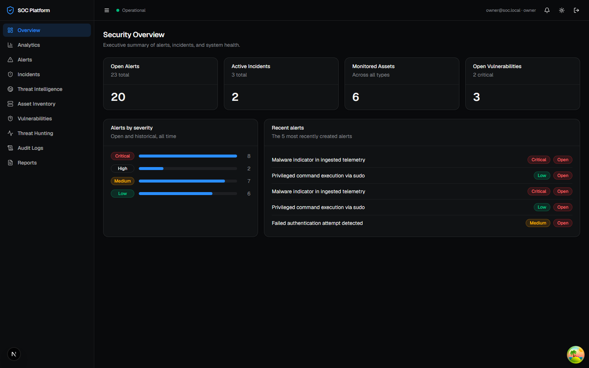

</td>
<td width="50%">

**Alerts triage queue**
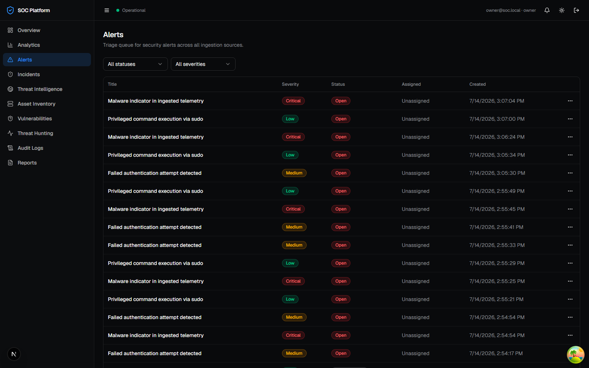

</td>
</tr>
<tr>
<td width="50%">

**Alert detail**
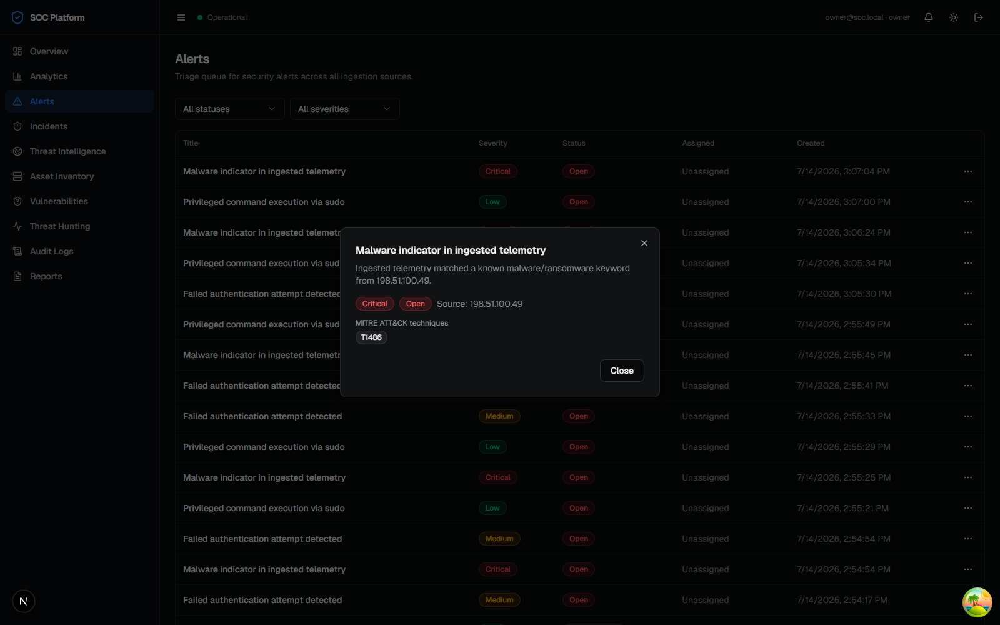

</td>
<td width="50%">

**Incidents — case management**
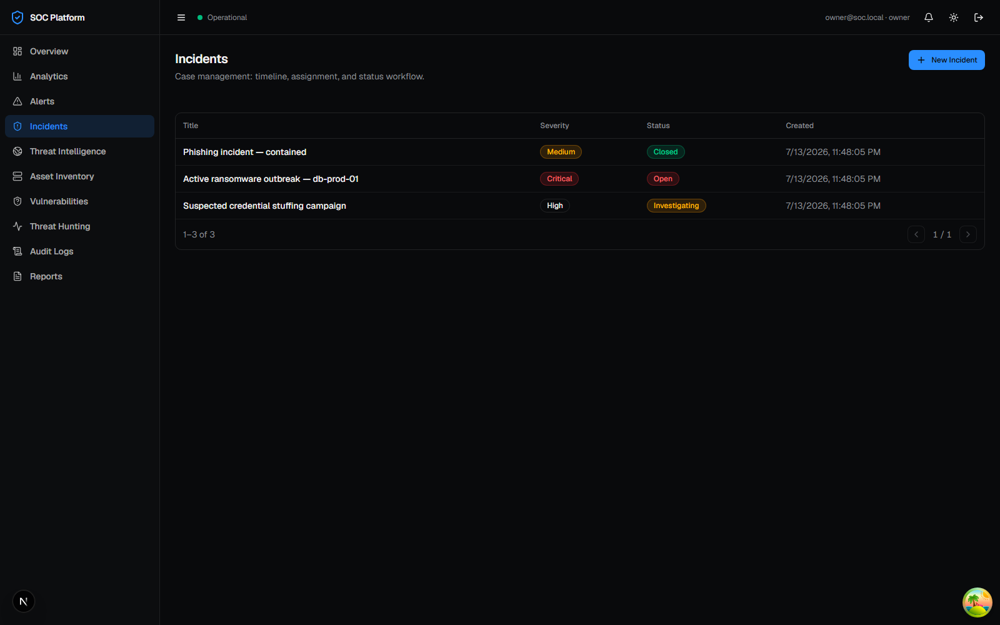

</td>
</tr>
<tr>
<td width="50%">

**Incident detail — timeline & status workflow**
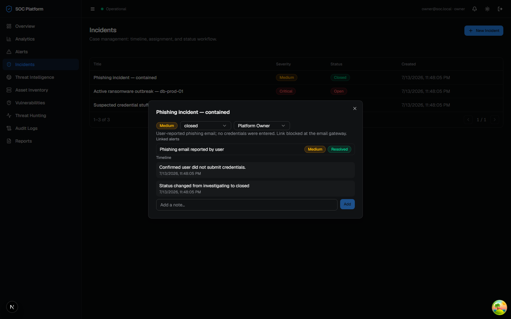

</td>
<td width="50%">

**Advanced Analytics — trends, MITRE, risk**
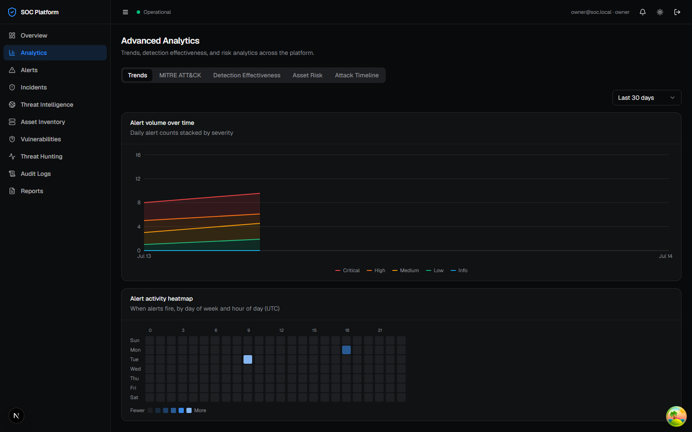

</td>
</tr>
<tr>
<td width="50%">

**Threat Intelligence — IOCs**
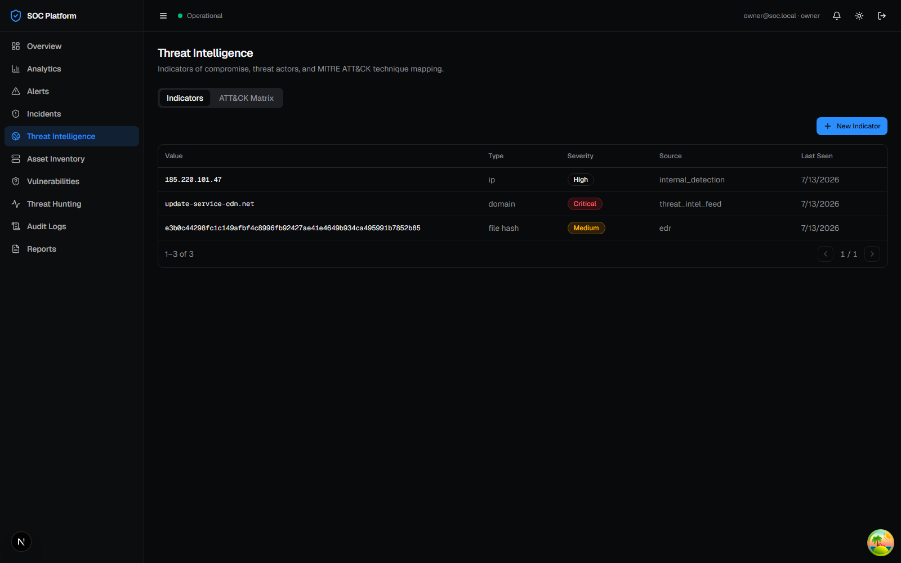

</td>
<td width="50%">

**Asset Inventory**
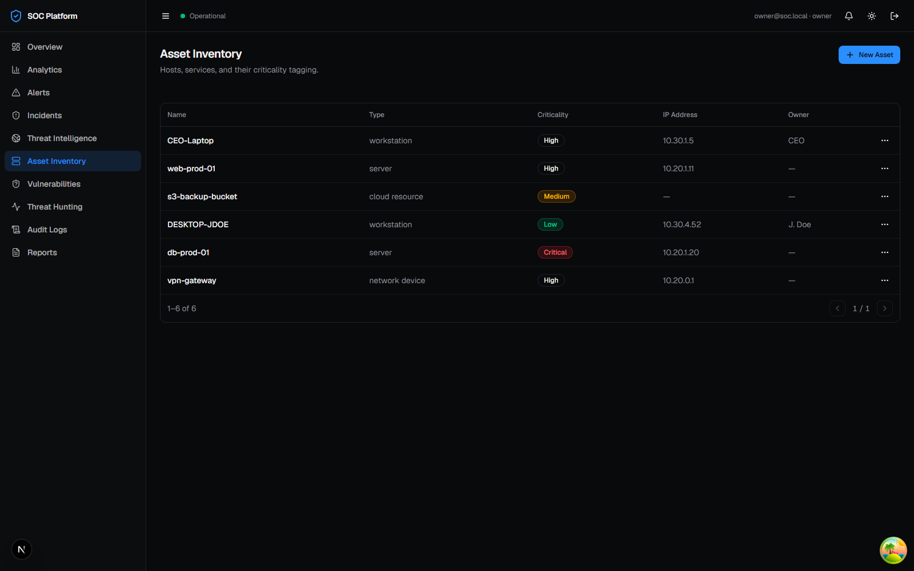

</td>
</tr>
<tr>
<td width="50%">

**Vulnerability Management**
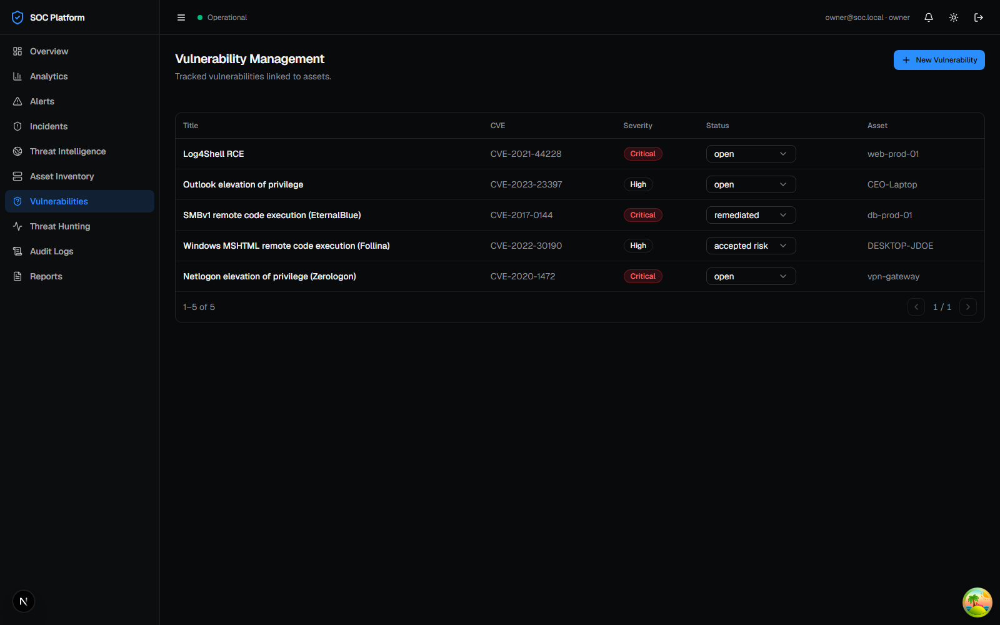

</td>
<td width="50%">

**Threat Hunting — raw event search**
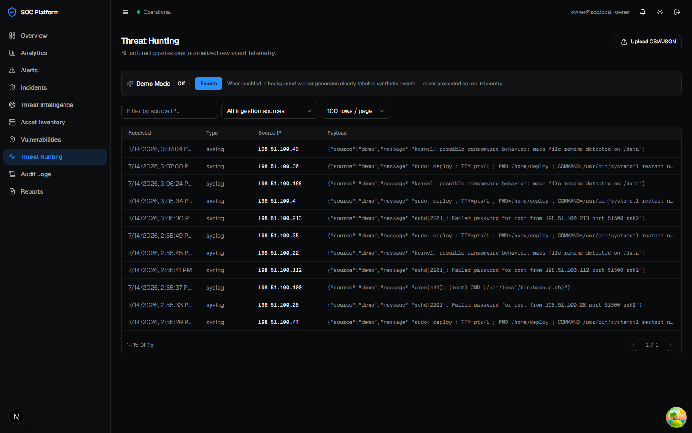

</td>
</tr>
<tr>
<td width="50%">

**Audit Logs**
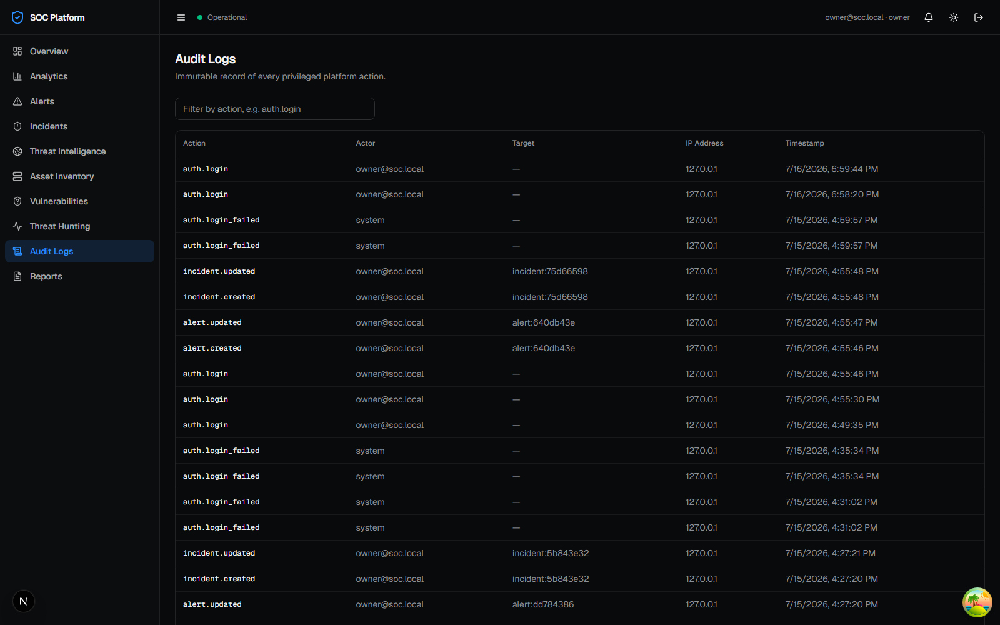

</td>
<td width="50%">

**Login**
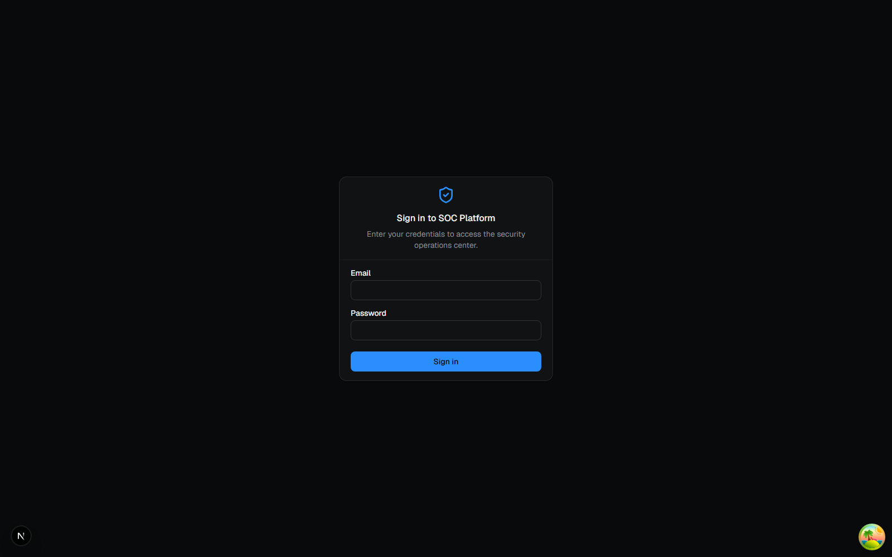

</td>
</tr>
</table>

## Monorepo layout

```text
apps/
  web/            Next.js (App Router, TypeScript strict, Tailwind, shadcn-style UI)
  api/            Fastify API (TypeScript strict, Zod validation, Pino logging, auth)
  worker/         BullMQ worker: ingestion pipeline, Demo Mode, scheduled jobs
packages/
  types/          Shared Zod schemas + inferred types, consumed by both apps
  ui/             Shared design tokens, theme provider, and cross-cutting components
  auth/           Password hashing (argon2id) and JWT/refresh-token primitives
  database/       Prisma schema, migrations, seed script
  connectors/     Ingestion parsers (syslog, CSV) and detection rules, shared by api + worker
  observability/  Custom OTel metric instruments (WS connections, ingestion lag, queue depth/failures)
  config/         Shared base tsconfig
deploy/
  helm/           Kubernetes Helm chart (soc-platform)
  terraform/      AWS reference module (ECS Fargate, RDS, ElastiCache, S3)
  observability/  OTel Collector, Prometheus, Tempo, Loki, Promtail, Grafana, Alertmanager configs
```

## Requirements

- Node.js ≥ 20
- pnpm ≥ 10 (`corepack enable` or `npm i -g pnpm`)
- Docker (for local Postgres + Redis)

## Getting started

```bash
pnpm install

# start local Postgres + Redis
docker compose up -d

# copy env templates and fill in DATABASE_URL / JWT_ACCESS_SECRET
cp apps/web/.env.example apps/web/.env.local
cp apps/api/.env.example apps/api/.env

# apply migrations and seed a dev owner account (owner@soc.local / ChangeMe123!)
pnpm --filter @soc/database db:migrate
pnpm --filter @soc/database db:seed

pnpm dev          # runs all apps in parallel via Turborepo
```

- Web: <http://localhost:3000> (redirects to `/login`)
- API: <http://localhost:4000> (`/health`, `/ready`, `/api/v1`, OpenAPI docs at `/docs` in non-production)

Rotate the seeded owner account's password before using this anywhere
beyond local development — see [`docs/release-checklist.md`](docs/release-checklist.md).

## Scripts

Run from the repo root (fanned out to every workspace package via Turborepo):

```bash
pnpm build          # production build
pnpm lint           # ESLint
pnpm typecheck      # tsc --noEmit
pnpm test           # Vitest (apps/api, apps/worker, packages/auth, packages/connectors, packages/observability, packages/ui)
pnpm test:coverage  # Vitest with coverage thresholds
pnpm format         # Prettier

# E2E + accessibility (needs Postgres/Redis + a seeded DB — see Getting started)
pnpm --filter @soc/web exec playwright install --with-deps chromium  # once
pnpm --filter @soc/web test:e2e
```

## Docker

A single multi-stage root `Dockerfile` builds all three apps via `--target`:

```bash
docker build --target api    -t soc-platform/api    .
docker build --target worker -t soc-platform/worker .
docker build --target web    -t soc-platform/web    .
```

`docker compose up -d` still only starts Postgres + Redis (the everyday
local-dev command, apps run via `pnpm dev` on the host for fast reload). To
run the entire platform containerized instead:

```bash
docker compose --profile full up --build
```

See [`docs/ci-cd.md`](docs/ci-cd.md) for the CI/security pipeline this feeds into.

## Observability

API and worker are instrumented with OpenTelemetry (traces + metrics),
exported to an OTel Collector that fans out to Prometheus (metrics) and Tempo
(traces); Promtail ships Pino logs to Loki; Grafana ties all three together
with pre-provisioned dashboards, and Prometheus Alertmanager handles SLO
alerts. Bring the whole stack up alongside the app:

```bash
docker compose --profile full --profile observability up --build
```

- Grafana: <http://localhost:3001> (anonymous viewer access; dashboards under the "SOC Platform" folder)
- Prometheus: <http://localhost:9090>
- Alertmanager: <http://localhost:9093>
- Tempo: <http://localhost:3200>

See [`docs/observability.md`](docs/observability.md) for the full pipeline, dashboard list, and alerting rules.

## Infrastructure

Two deployment paths, both consuming the same Docker images — see
[`docs/deployment.md`](docs/deployment.md):

- **Kubernetes**: `deploy/helm/soc-platform` — a Helm chart, live-tested end
  to end on a real local cluster (login round-trip, a Postgres-outage
  readiness-probe test, and a broken-rollout/`helm rollback` cycle).
- **AWS (no Kubernetes)**: `deploy/terraform` — VPC, RDS Postgres,
  ElastiCache Redis, ECR, ECS Fargate, ALB, S3. `init`/`validate`/`plan`'d
  successfully (no AWS account available to `apply` against).

## Documentation

| Doc                                                      | Covers                                                                       |
| -------------------------------------------------------- | ---------------------------------------------------------------------------- |
| [`docs/architecture.md`](docs/architecture.md)           | System design, data flow, and the reasoning behind the non-obvious decisions |
| [`docs/api.md`](docs/api.md)                             | REST API reference (generated from the live OpenAPI spec) + narrative        |
| [`docs/database-erd.md`](docs/database-erd.md)           | Entity-relationship diagram + schema design notes                            |
| [`docs/security.md`](docs/security.md)                   | AuthN/AuthZ, CSRF, dependency scanning, secrets management                   |
| [`docs/deployment.md`](docs/deployment.md)               | Kubernetes/Helm and Terraform/ECS deployment, rollback procedures            |
| [`docs/observability.md`](docs/observability.md)         | OpenTelemetry/Prometheus/Tempo/Loki/Grafana pipeline                         |
| [`docs/ci-cd.md`](docs/ci-cd.md)                         | GitHub Actions pipelines, branch protection, Dependabot                      |
| [`docs/release-checklist.md`](docs/release-checklist.md) | Concrete pre-flight checklist for a real production deploy                   |
| [`CONTRIBUTING.md`](CONTRIBUTING.md)                     | Dev workflow, code conventions, testing conventions                          |

## License

MIT — see [LICENSE](LICENSE).
