# Database ERD

Source of truth is [`packages/database/prisma/schema.prisma`](../packages/database/prisma/schema.prisma). This diagram is a hand-maintained view of it — if they drift, trust the schema file and update this diagram to match.

```mermaid
erDiagram
    User ||--o{ Session : "has"
    User ||--o{ AuditLog : "performs (actor)"
    User ||--o{ Alert : "assigned"
    User ||--o{ Incident : "assigned"
    User ||--o{ IncidentTimelineEvent : "authors"
    User ||--o{ Notification : "receives"

    Asset ||--o{ Alert : "affected by"
    Asset ||--o{ Vulnerability : "has"

    ThreatActor ||--o{ IOC : "attributed"

    Incident ||--o{ Alert : "groups"
    Incident ||--o{ IncidentTimelineEvent : "has"

    IngestionSource ||--o{ Alert : "produces"
    IngestionSource ||--o{ RawEvent : "produces"

    Alert ||--o{ AlertMitreMapping : "maps to"
    MitreTechnique ||--o{ AlertMitreMapping : "mapped from"

    User {
        string id PK
        string email UK
        string passwordHash
        string name
        enum role "owner | admin | analyst | read_only"
        boolean isActive
    }

    Session {
        string id PK
        string userId FK
        string refreshTokenHash UK "sha256, never the raw token"
        datetime expiresAt
        datetime revokedAt "null while active"
    }

    AuditLog {
        string id PK
        string actorId FK "nullable — system-initiated actions"
        string action
        string targetType
        string targetId
        json metadata
    }

    Asset {
        string id PK
        string name
        enum type "server | workstation | network_device | cloud_resource | other"
        string ipAddress
        enum criticality "Severity"
        string[] tags
    }

    Vulnerability {
        string id PK
        string title
        string cveId
        enum severity
        enum status "open | remediated | accepted_risk | false_positive"
        string assetId FK
        datetime discoveredAt
        datetime remediatedAt
    }

    ThreatActor {
        string id PK
        string name UK
        string[] aliases
        string sophistication
    }

    IOC {
        string id PK
        enum type "ip | domain | url | file_hash | email"
        string value
        enum severity
        string threatActorId FK
        datetime firstSeenAt
        datetime lastSeenAt
    }

    MitreTechnique {
        string id PK "e.g. T1110 — seeded reference data"
        string name
        string tactic
    }

    Incident {
        string id PK
        string title
        enum severity
        enum status "open | investigating | contained | resolved | closed"
        string assignedToId FK
        datetime closedAt
    }

    IncidentTimelineEvent {
        string id PK
        string incidentId FK
        string authorId FK
        enum eventType "note | status_change | assignment | alert_linked"
        string message
    }

    IngestionSource {
        string id PK
        string name
        enum type "demo_generator | syslog | file_upload | webhook"
        boolean isActive
        json config
    }

    RawEvent {
        string id PK
        string ingestionSourceId FK
        json payload "landing zone for un-normalized telemetry"
        datetime receivedAt
    }

    Alert {
        string id PK
        string title
        enum severity
        enum status "open | acknowledged | resolved | false_positive"
        string assetId FK
        string ingestionSourceId FK
        string assignedToId FK
        string incidentId FK "nullable — not every alert is triaged into an incident"
    }

    AlertMitreMapping {
        string alertId PK,FK
        string mitreTechniqueId PK,FK
    }

    Notification {
        string id PK
        string userId FK
        enum type "alert | incident | system"
        datetime readAt "null while unread"
    }
```

## Notes on design choices

- **`Alert.incidentId` is a simple nullable FK, not a join table.** An alert belongs to at most one incident at a time; an incident groups many alerts. This is the realistic cardinality for triage workflows and avoids an unnecessary many-to-many.
- **`AlertMitreMapping` is a genuine many-to-many join table** (composite primary key `[alertId, mitreTechniqueId]`) because an alert commonly maps to multiple ATT&CK techniques and a technique appears across many alerts.
- **`Session.refreshTokenHash` stores a SHA-256 hash, never the raw token.** See [`docs/security.md`](security.md) — a database read alone can't be replayed as a live session.
- **`RawEvent.payload` is intentionally schema-loose (`Json`)** — it's the landing table for whatever an ingestion connector produces before normalization; `Alert` is the normalized, correlated output that the rest of the platform actually queries against.
- **`MitreTechnique` is seeded reference data**, not user-editable through the API — see `packages/database/prisma/seed-data/mitre-techniques.ts`.
